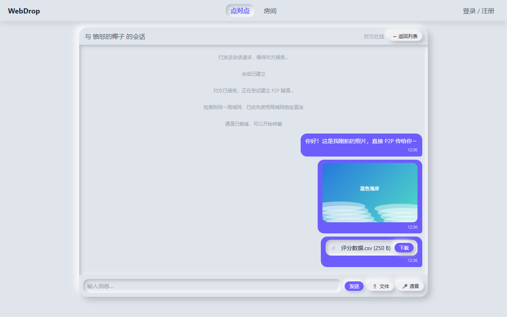
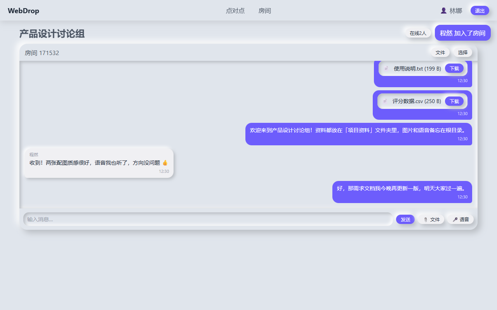
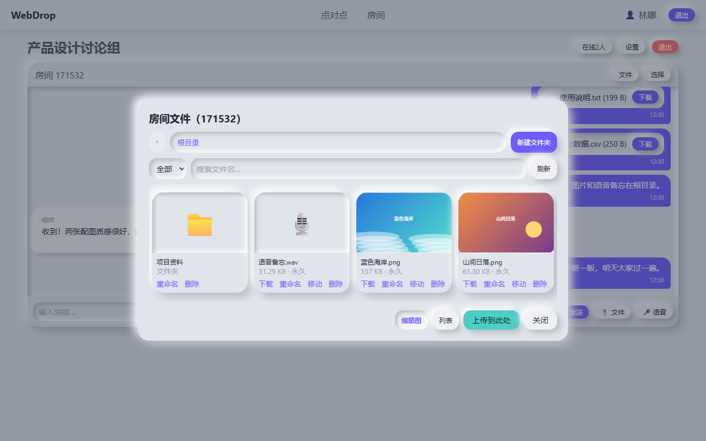
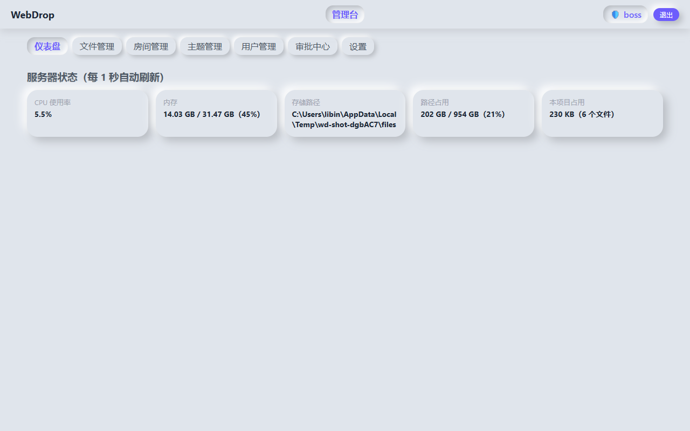
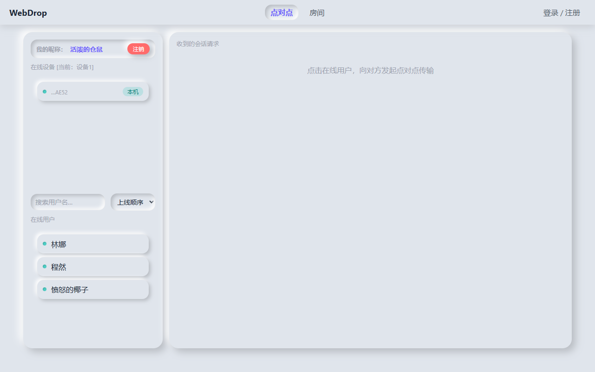
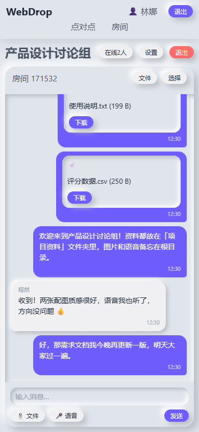
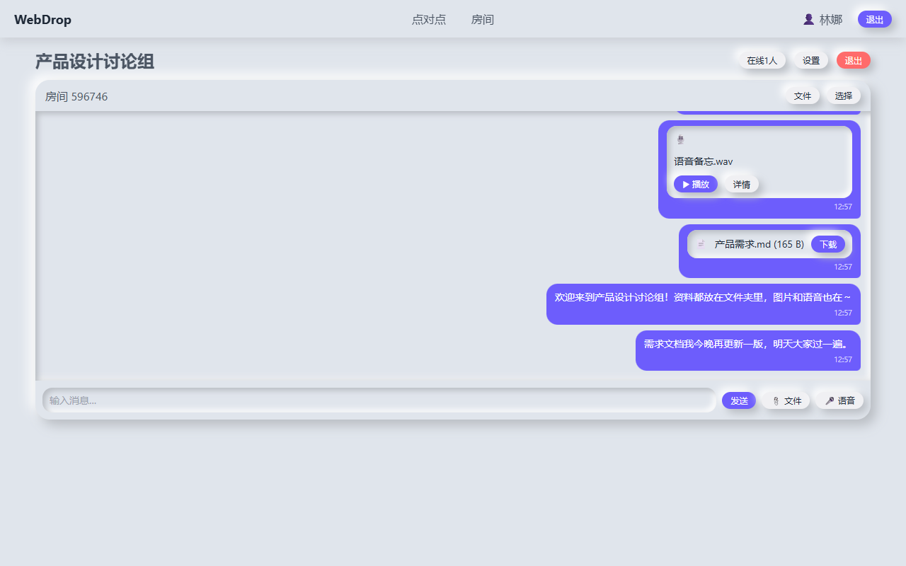
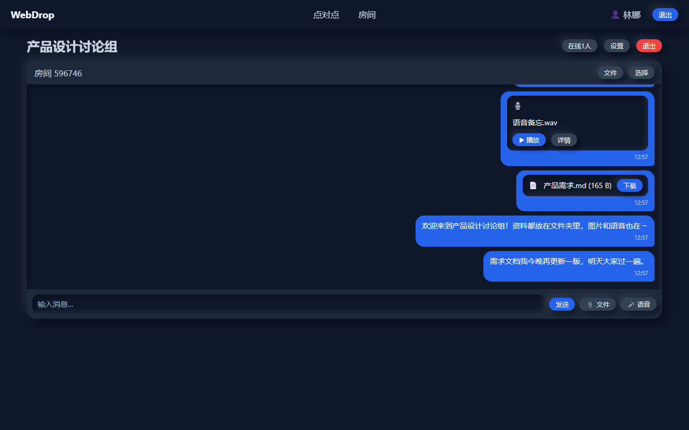
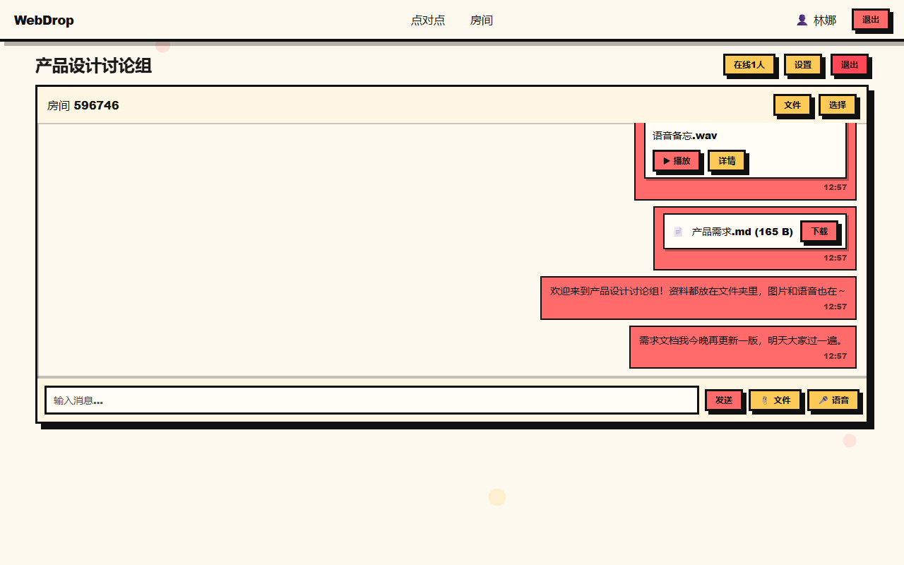
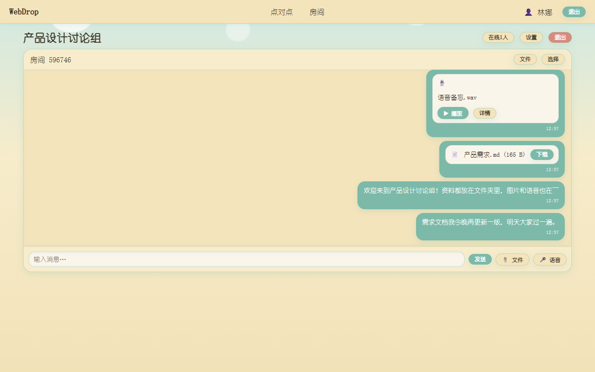

# WebDrop for fnOS

[GitHub 仓库](https://github.com/kuka1774083-wq/WebDropForFnOS)

这是 WebDrop 的飞牛 fnOS 原生应用包工程。它使用飞牛 Node.js v22 运行时直接启动 WebDrop，不安装或创建 Docker 容器；运行数据保存在应用自己的 `TRIM_PKGVAR/config` 与 `TRIM_PKGVAR/data` 目录中。

- 作者项目主页：https://github.com/kuka1774083-wq/WebDropForFnOS
- 发布者主页：https://space.bilibili.com/41158746?spm_id_from=333.1007.0.0

## 示例截图

| 点对点会话 | 房间聊天 |
| --- | --- |
|  |  |

| 房间文件（缩略图模式） | 管理台仪表盘 |
| --- | --- |
|  |  |

| 点对点在线列表 | 手机端房间 |
| --- | --- |
|  |  |

## 打包

在本目录安装 fnpack 后执行：

```powershell
fnpack build -d .
```

安装向导默认使用 8080 端口。修改端口后，请从 `http://飞牛主机IP:所选端口` 访问 WebDrop。

安装时可明文设置 WebDrop 管理员账号和密码，默认均为 `admin`。自定义凭据不会触发首次登录改密；仅默认 `admin/admin` 会要求修改。飞牛管理员桌面还会显示“WebDrop 管理后台”图标，直达 `/admin`。

WebDrop 的独立端口继续支持免登录访问。登录页的“使用飞牛账号登录”会先打开同一主机的飞牛原生登录页（HTTP 为 `5666` 端口、HTTPS 为 `5667` 端口）；登录成功后才回跳至统一网关入口 `/app/WebDrop`。网关校验飞牛会话后显示账号登录确认页，确认后才会回到独立端口。飞牛账号首次仅需填写昵称，设置页不显示用户名和密码修改选项；用户名前会显示 `[fnos]`，清空昵称后会回退显示飞牛系统用户名。

内置公共主题会随安装包提供。应用启动和升级时会将缺失的主题补回 `data/themes/public`，不会覆盖已有主题文件。

卸载向导默认保留使用记录。选择清除后，会删除数据库、上传文件、聊天记录和配置。

## 功能特性

### 点对点模式（免登录）
- 打开网页自动分配临时身份与趣味昵称（如"可爱的桃子""愤怒的香蕉"），进入即在线；聊天消息显示发送时间，可一键注销释放身份。
- 同一浏览器不允许多开；同一账号可多端登录，设备按指纹生成唯一 UUID，在线列表同时展示"在线设备"与"在线用户"，会话按设备建立。
- 优先尝试 WebRTC 直连（ICE 候选优先 IPv6），同一局域网自动识别并优先局域网地址；失败自动回退服务器中转（不落盘）。
- 文本实时送达；< 10M 文件服务器暂存，> 10M 需对方点击接收后传输，接收完成自动下载；大文件传输支持随时取消。
- 会话建立前仅展示请求列表，建立后只显示聊天窗口；会话中的用户对其他用户显示"繁忙"。
- 选文件时心跳自动放宽到 5 分钟，回到聊天界面立即检查对方在线状态并补拉错过的消息。

### 房间模式（注册制）
- 注册需邮箱或 QQ，管理员审核通过后登录；房间数量按会员等级（V0-V6）分配。
- 随机 6 位房间号；自定义房间号需管理员审批；可设置房间密码（默认无）。
- 文字、语音（m4a 录制）、照片、视频、任意文件；上传带进度条，完成后其他成员才能看到。
- 房主可设置文件最长保留时间、单文件上限、房间总容量、上传/下载权限，可踢出/拉黑成员，可删除/恢复聊天消息。
- 房间文件支持缩略图/列表模式、分类筛选、名称搜索、文件夹管理（创建/重命名/移动/删除，仅房主）。
- 已删除的文件不在列表中展示，聊天气泡显示"文件已删除"；成员列表仅显示当前在线成员。

### 管理后台
- 通过http://host[:port]/admin , 可以打开管理后台
- 唯一管理员 `admin:admin`，首次登录强制修改用户名和密码；登录后直接进入管理台，不参与普通用户功能。
- 仪表盘实时监控 CPU / 内存 / 存储占用；文件管理按会话与房间分组；房间管理可查看与修改每个房间的设置。
- 用户管理支持审批、封禁、删除与会员等级调整，可一键清理全部临时用户。
- 主题系统：管理员可上传/删除公共主题、下载默认模板、设置全局主题；用户可上传个人主题并预览。

## 主题系统

WebDrop 默认采用新拟物派（Neumorphism）风格，并内置了 6 套风格各异的公共主题：**暗黑模式、孟菲斯风格、拟物风格、漫画风格、蒸汽朋克、吉卜力风格**。登录用户在设置页即可一键切换，管理员还能将任意主题设为**全局默认主题**（所有人跟随）。下面为默认主题与其中 3 套内置主题在房间页面的实际效果：

| 默认主题（新拟物派） | 暗黑模式 |
| --- | --- |
|  |  |

| 孟菲斯风格 | 吉卜力风格 |
| --- | --- |
|  |  |

### 自制主题

主题以 zip 包形式分发，内含两个文件：

```text
主题包.zip
├── theme.json   # { name, version, author, description }
└── theme.css    # 覆盖 :root 下的 CSS 变量（模板内含详细注释）
```

主题包存放位置与权限：

| 上传者 | 位置 | 权限 |
| --- | --- | --- |
| 管理员 | `data/themes/public/` | 所有用户可见；管理员可删除 |
| 注册用户 | `data/themes/{用户UUID}/` | 仅自己可见；注销账号时自动删除 |

- 管理员可在主题管理中**下载默认模板 zip**，修改 `theme.css` 变量即可快速换肤；
- 用户设置页同样提供模板下载；公共主题只读，个人主题可上传/删除；
- 选中主题包会打开**预览窗口**，渲染各界面效果图并展示版本、作者与描述；
- 用户可在"跟随全局（默认）/ 指定主题"之间切换；管理员确认后可将主题设为全局默认。

## 如何更新

在飞牛应用中心打开“手动安装”，直接选择新版 `WebDrop.fpk` 上传并完成安装即可。升级会保留现有管理员、运行端口、数据和公共主题。

## 运行数据

应用运行数据固定保存在飞牛应用自己的目录：

| 目录 | 用途 |
| --- | --- |
| `TRIM_PKGVAR/config/` | WebDrop 配置和管理员凭据 |
| `TRIM_PKGVAR/data/` | SQLite 数据库、房间文件、聊天记录、上传内容和主题 |

卸载时可选择是否清除上述使用记录。
